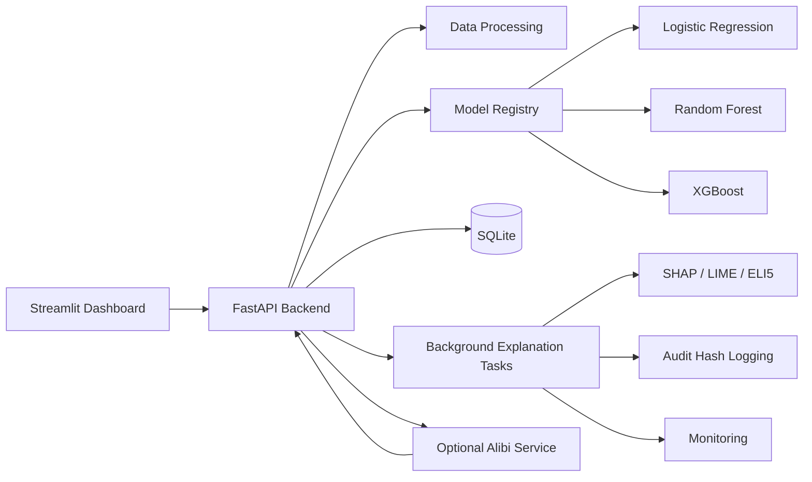
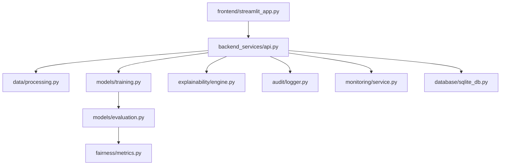
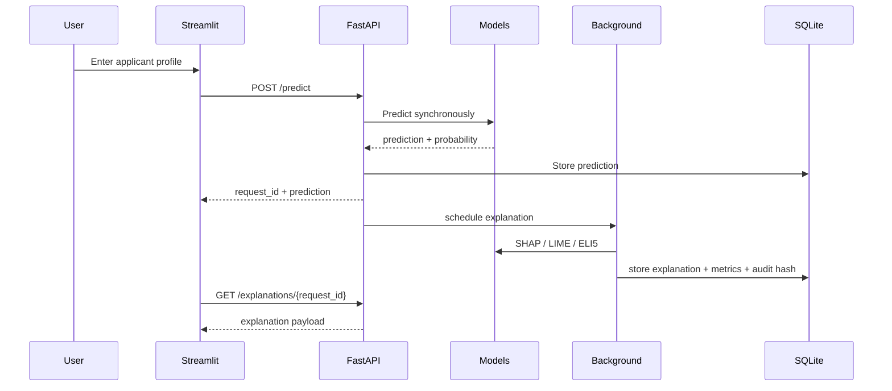

# Architecture

This prototype implements a local Explainable AI financial decision platform with a modular Python stack.

## Assumption

The provided `data/german_credit.csv` file does not include a ground-truth default label. To keep the prototype runnable, the platform derives a transparent binary `credit_risk` target using repayment burden, duration, account liquidity, housing, and purpose risk heuristics. This is for demonstration only.

## System architecture

## Component diagram

## Data flow diagram

